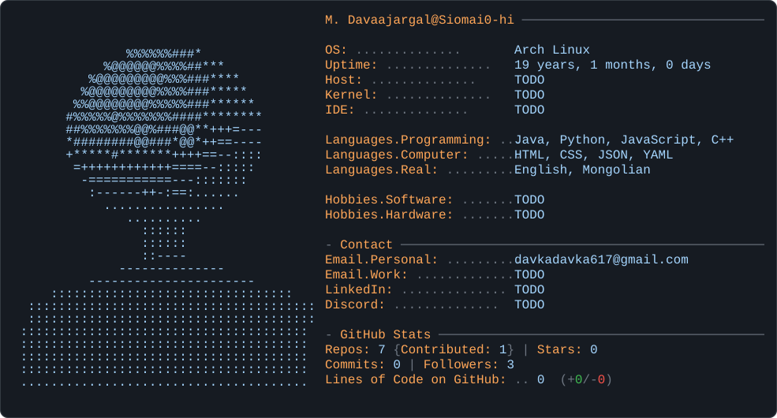

<picture>
  <source media="(prefers-color-scheme: dark)" srcset="assets/dark_mode.svg">
  <source media="(prefers-color-scheme: light)" srcset="assets/light_mode.svg">
  
</picture>

## What this card shows

Everything inside the image is generated, not hand-typed. The card has two
sources and one updater:

| Piece | Made by | Refreshed by |
|---|---|---|
| ASCII portrait | `tools/make_ascii.py` or `tools/make_portrait.py` | only when you replace `me.jpg` |
| Layout, colours, columns | `tools/build_svg.py` | only when you edit `tools/build_svg.py` |
| Uptime, repos, stars, commits, followers, LOC | placeholder values in the SVG | `today.py`, daily via GitHub Actions |

